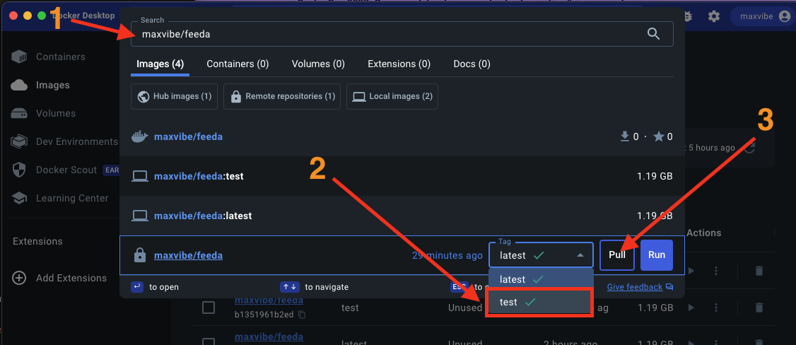

# Local SERVER usage

1. Make sure you have installedd, authorized and TURNED ON `Docker Desktop`

2. Go to Docker Desktop:

- paste to search `maxvibe/feeda`
- choose Tag `test`
- click button `Pull`
  

3. Go to Terminal(cmd or comand line) and enter `docker run -p 8000:8000 maxvibe/feeda:test`

4. Go to [http://localhost:8000/admin](http://localhost:8000/admin) and login just created superuser

5. Use API as `http://localhost:8000/[endpoint]`

### After all this steps are done, next time you don't have to do them, just start docker server from Docker Desktop, that will be enougth.

# Local CLIENT/CMS (application) usage

1. Make sure you have installedd, authorized and TURNED ON `Docker Desktop`

2. Open terminal, go to cleint/cms directory (command line) and enter `COMPOSE_DOCKER_CLI_BUILD=1 DOCKER_BUILDKIT=1 docker-compose build`

3. Then enter `docker-compose up`

4. Go to [http://localhost:3000/](http://localhost:3000/)
