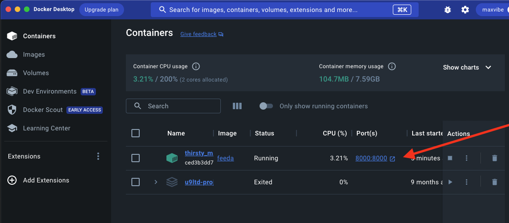
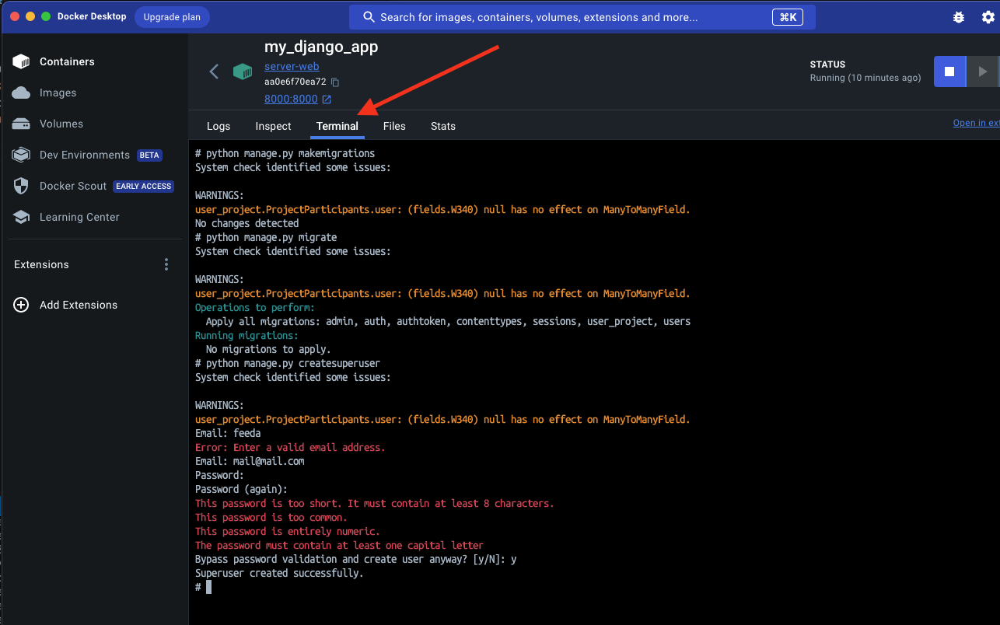
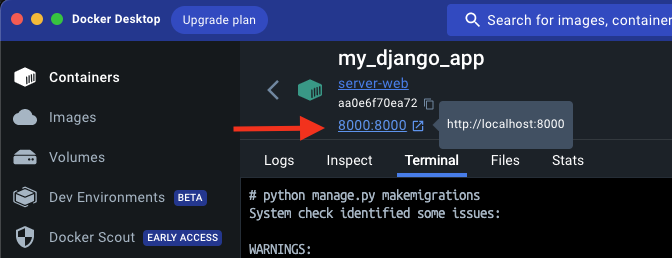

**Local use**

1. Make sure you have installedd and authorized `Docker Desktop`

2. Go to the server directory `cd server`

3. Enter in terminal command `docker build -t feeda .`
4. Then enter `docker run -p 8000:8000 feeda`

5. Go to Docker Desktop and click on container with port 8000:8000
   

6. Go to the terminal
   

7. Then create superuser (it will be our admin for DB usage):

- `python manage.py createsuperuser`
  - add email Email:[random@email.com]
  - add pass Password:[random pass] (while pasting, the pass will not appear, коли вводиш пароль не відображається)
- if you see the message `Bypass password validation and create user anyway? [y/N]: y` - just paste `y`

7. Go to `http://localhost:8000/admin` and login just created superuser
   

8. Use API as `http://localhost:8000/[endpoint]`

9. After all this steps are done, next time you don't have to do them, just start docker server from Docker Desktop, that will be enougth.
